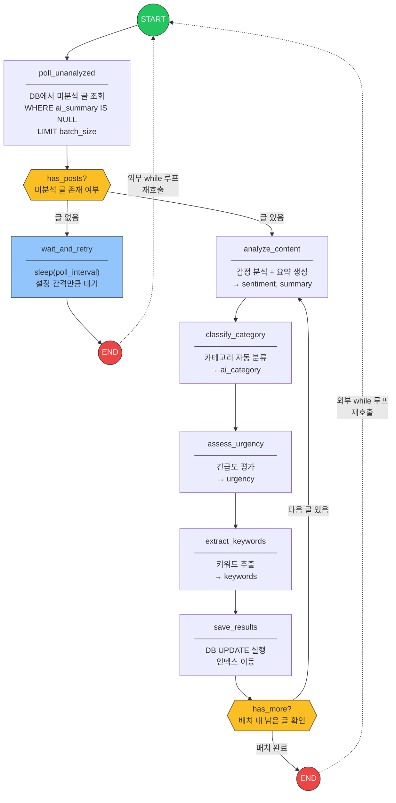

# Polling 기반 LangGraph 문의 분석 에이전트 아키텍처

## 1. 개요

고객 문의 게시판에 새 글이 등록되면 에이전트가 **스스로 감지**하여 내용을 분석하고 주제를 분류하는 시스템이다.

### 현재 방식 (Webhook)

```
사용자 글 등록 → Express 서버 → HTTP POST → Flask 에이전트 → 결과 저장
```

- 서버가 에이전트에 직접 요청을 보내는 **수동적** 구조
- 서버-에이전트 간 강결합, Flask 서버 항상 기동 필요

### 변경 방식 (Polling)

```
사용자 글 등록 → Express 서버 → DB 저장 (끝)

에이전트: DB 주기 조회 → 미분석 글 발견 → 분석 → 결과 저장 (독립 루프)
```

- 에이전트가 스스로 새 글을 찾아 처리하는 **능동적** 구조
- 서버와 에이전트 완전 분리, 독립 배포/재시작 가능

---

## 2. 전체 시스템 구성도

```
 ┌─────────────────────────────────────────────────────────────────┐
 │                        시스템 전체 구조                          │
 │                                                                 │
 │  ┌─────────┐        ┌──────────────────┐                       │
 │  │         │──HTTP──▶│                  │                       │
 │  │  사용자  │        │  Express 서버     │                       │
 │  │ (브라우저)│◀─HTML──│  :3030           │                       │
 │  │         │        │                  │                       │
 │  └─────────┘        │  - 문의 CRUD API  │                       │
 │                     │  - 정적 파일 서빙  │                       │
 │                     └────────┬─────────┘                       │
 │                              │                                  │
 │                              │ INSERT / SELECT                  │
 │                              ▼                                  │
 │                     ┌──────────────────┐                       │
 │                     │                  │                       │
 │                     │    SQLite DB     │                       │
 │                     │   inquiries.db   │                       │
 │                     │   (WAL mode)     │                       │
 │                     │                  │                       │
 │                     └────────┬─────────┘                       │
 │                              │                                  │
 │                              │ SELECT (미분석 글)                │
 │                              │ UPDATE (분석 결과)                │
 │                              ▼                                  │
 │                     ┌──────────────────┐     ┌──────────────┐  │
 │                     │                  │     │              │  │
 │                     │  Polling Agent   │────▶│  Claude API   │  │
 │                     │  (독립 프로세스)   │◀────│  (Anthropic)  │  │
 │                     │                  │     │              │  │
 │                     │ polling_agent.py │     └──────────────┘  │
 │                     └──────────────────┘                       │
 │                                                                 │
 └─────────────────────────────────────────────────────────────────┘
```

### 설계 원칙

| 원칙 | 설명 |
|------|------|
| **완전 분리** | Express 서버와 에이전트는 DB만 공유, 직접 통신 없음 |
| **독립 실행** | Flask 서버 불필요, 에이전트는 단독 Python 프로세스 |
| **무중단 운영** | 에이전트 재시작 시 밀린 글 자동 일괄 처리 |
| **동시 접근 안전** | SQLite WAL 모드로 읽기/쓰기 동시 가능 |

---

## 3. LangGraph 그래프 구조

### 3.1 그래프 다이어그램



### 3.2 ASCII 다이어그램

```
                         ┌─────────┐
                         │  START  │
                         └────┬────┘
                              ▼
                    ┌──────────────────┐
                    │ poll_unanalyzed  │◀──────────────────────┐
                    │                  │                       │
                    │ SELECT id,title, │                       │
                    │ content          │                       │
                    │ WHERE ai_summary │                       │
                    │   IS NULL        │                       │
                    │ LIMIT batch_size │                       │
                    └────────┬─────────┘                       │
                             ▼                                 │
                     ┌──────────────┐                          │
                     │  has_posts?  │                          │
                     └──┬───────┬───┘                          │
                없음 │       │ 있음                            │
                     ▼       ▼                                 │
      ┌────────────────┐  ┌────────────────┐                   │
      │ wait_and_retry │  │analyze_content │                   │
      │                │  │                │                   │
      │ sleep(interval)│  │ LLM 호출       │                   │
      └───────┬────────┘  │ → sentiment    │                   │
              │           │ → summary      │                   │
              ▼           └───────┬────────┘                   │
         ┌────────┐               ▼                            │
         │  END   │     ┌────────────────┐                     │
         └────────┘     │classify_       │                     │
              │         │  category      │                     │
              │         │                │                     │
   외부 while │         │ LLM 호출       │                     │
    루프 재호출│         │ → ai_category  │                     │
              │         └───────┬────────┘                     │
              │                 ▼                              │
              │       ┌────────────────┐                       │
              │       │assess_urgency  │                       │
              │       │                │                       │
              │       │ LLM 호출       │                       │
              │       │ → urgency      │                       │
              │       └───────┬────────┘                       │
              │               ▼                                │
              │       ┌────────────────┐                       │
              │       │extract_        │                       │
              │       │  keywords      │                       │
              │       │                │                       │
              │       │ LLM 호출       │                       │
              │       │ → keywords     │                       │
              │       └───────┬────────┘                       │
              │               ▼                                │
              │       ┌────────────────┐                       │
              │       │ save_results   │                       │
              │       │                │                       │
              │       │ UPDATE         │                       │
              │       │ inquiries SET  │                       │
              │       │ ai_category,   │                       │
              │       │ ai_sentiment,  │                       │
              │       │ ai_urgency,    │                       │
              │       │ ai_keywords,   │                       │
              │       │ ai_summary     │                       │
              │       └───────┬────────┘                       │
              │               ▼                                │
              │        ┌────────────┐                          │
              │        │ has_more?  │                          │
              │        └──┬──────┬──┘                          │
              │    다음글 │      │ 배치 완료                    │
              │           │      ▼                             │
              │           │  ┌────────┐                        │
              │           │  │  END   │────── 외부 while ──────┘
              │           │  └────────┘       루프 재호출
              │           │
              │           └──▶ analyze_content (배치 내 다음 글)
              │
              └──────────────▶ poll_unanalyzed (재호출)
```

### 3.3 노드 상세

| 노드 | 역할 | 입력 State | 출력 State |
|------|------|-----------|-----------|
| `poll_unanalyzed` | DB에서 미분석 글 조회 | `db_path`, `batch_size` | `pending_posts`, `current_index`, `title`, `content` |
| `wait_and_retry` | 설정 간격 대기 | `poll_interval` | `poll_count` +1 |
| `analyze_content` | 감정 분석 + 요약 | `title`, `content` | `sentiment`, `summary` |
| `classify_category` | 카테고리 분류 | `title`, `content` | `ai_category` |
| `assess_urgency` | 긴급도 평가 | `title`, `content`, `sentiment` | `urgency` |
| `extract_keywords` | 키워드 추출 | `title`, `content` | `keywords` |
| `save_results` | 결과 DB 저장 | 모든 분석 결과 | `current_index` +1 |

### 3.4 조건부 라우팅 (Conditional Edges)

| 분기점 | 조건 함수 | True | False |
|--------|----------|------|-------|
| `has_posts` | `len(pending_posts) > 0` | → `analyze_content` | → `wait_and_retry` |
| `has_more` | `current_index < len(pending_posts)` | → `analyze_content` | → `END` |

---

## 4. State 설계

```python
class InquiryRecord(TypedDict):
    """DB에서 가져온 단일 문의 레코드"""
    id: int
    title: str
    content: str


class PollingAgentState(TypedDict):
    # ──────────── 폴링 제어 ────────────
    pending_posts: list[InquiryRecord]  # 현재 배치의 미분석 글 목록
    current_index: int                   # 배치 내 현재 처리 위치
    poll_count: int                      # 누적 폴링 횟수 (로깅용)

    # ──────────── 현재 글 정보 ────────────
    current_id: int                      # 현재 분석 중인 글 ID
    title: str                           # 현재 글 제목
    content: str                         # 현재 글 본문

    # ──────────── 분석 결과 (각 노드가 채움) ────────────
    ai_category: str                     # 자동 분류된 카테고리
    sentiment: str                       # 감정 (긍정/부정/중립)
    urgency: str                         # 긴급도 (높음/보통/낮음)
    keywords: list[str]                  # 핵심 키워드 3~5개
    summary: str                         # 1~2문장 요약

    # ──────────── 에러 추적 ────────────
    error_count: int                     # 연속 에러 횟수
    last_error: str                      # 마지막 에러 메시지

    # ──────────── 설정 ────────────
    db_path: str                         # SQLite DB 파일 경로
    poll_interval: int                   # 폴링 간격 (초, 기본 10)
    batch_size: int                      # 한 번에 가져올 글 수 (기본 5)
```

### State 흐름

```
초기 State
  │
  ▼
poll_unanalyzed ─── pending_posts: [{id:5, ...}, {id:6, ...}]
  │                  current_index: 0
  │                  title: "주문 취소 요청"
  │                  content: "주문번호 ORD-123..."
  ▼
analyze_content ─── sentiment: "부정"
  │                  summary: "주문 취소를 요청하는 문의"
  ▼
classify_category ─ ai_category: "교환/반품"
  │
  ▼
assess_urgency ──── urgency: "높음"
  │
  ▼
extract_keywords ── keywords: ["주문취소", "환불", "주문번호"]
  │
  ▼
save_results ────── DB UPDATE 완료
  │                  current_index: 1
  │                  title: (다음 글 로드)
  ▼
has_more? → 다음 글 → analyze_content (반복)
         → 배치 완료 → END → 외부 루프 재호출
```

---

## 5. 데이터 흐름

### 5.1 새 글 감지 (poll_unanalyzed)

```sql
SELECT id, title, content
FROM inquiries
WHERE ai_summary IS NULL
  AND ai_retry_count < 3        -- 반복 실패 글 제외
ORDER BY id ASC
LIMIT {batch_size};
```

### 5.2 결과 저장 (save_results)

```sql
UPDATE inquiries
SET ai_category  = ?,
    ai_sentiment = ?,
    ai_urgency   = ?,
    ai_keywords  = ?,          -- JSON 문자열
    ai_summary   = ?,
    updated_at   = CURRENT_TIMESTAMP
WHERE id = ?;
```

### 5.3 실패 시 재시도 카운트 증가

```sql
UPDATE inquiries
SET ai_retry_count = ai_retry_count + 1
WHERE id = ?;
```

---

## 6. 실행 구조

### 6.1 외부 루프 (recursion_limit 회피)

```
┌─────────────────────────────────────────────┐
│             외부 while 루프                   │
│                                             │
│   ┌─────────────────────────────────────┐   │
│   │        LangGraph 그래프 1회 실행      │   │
│   │                                     │   │
│   │  poll → 분석 → 저장 → END            │   │
│   │  (또는 poll → 대기 → END)            │   │
│   └─────────────────────────────────────┘   │
│                    │                         │
│                    ▼                         │
│             state 초기화 후                   │
│              다시 invoke()                   │
│                                             │
│   ※ 에러 발생 시 지수 백오프 후 재시도         │
│   ※ SIGINT/SIGTERM 수신 시 graceful 종료     │
└─────────────────────────────────────────────┘
```

### 6.2 프로세스 배치

```
터미널 1                           터미널 2
─────────────────────────         ─────────────────────────
$ node server.js                  $ python polling_agent.py

서버 시작: :3030                   [INFO] 에이전트 시작
  │                                  │
  ├── POST /api/inquiries            ├── 폴링 #1: 미분석 0건
  │   (글 등록, DB INSERT)            │   → 10초 대기
  │                                  │
  │                                  ├── 폴링 #2: 미분석 1건 발견!
  │                                  │   → 분석 시작
  │                                  │   → [감정: 부정]
  │                                  │   → [분류: 배송문의]
  │                                  │   → [긴급도: 높음]
  │                                  │   → [키워드: 배송,지연,주문]
  │                                  │   → DB 저장 완료
  │                                  │
  ├── GET /api/inquiries/2           ├── 폴링 #3: 미분석 0건
  │   (AI 분석 결과 포함 응답)          │   → 10초 대기
  ▼                                  ▼
```

---

## 7. 에러 처리 전략

### 7.1 에러 유형별 처리

```
┌──────────────────┬────────────────┬──────────────────────────────┐
│ 에러 유형         │ 발생 지점       │ 처리 전략                     │
├──────────────────┼────────────────┼──────────────────────────────┤
│ DB 연결 실패      │ poll, save     │ 지수 백오프                   │
│                  │                │ (2s → 4s → 8s → ... → 60s)  │
├──────────────────┼────────────────┼──────────────────────────────┤
│ LLM API 타임아웃  │ 분석 노드들     │ 해당 글 건너뛰기              │
│                  │                │ 다음 폴링에서 재시도            │
├──────────────────┼────────────────┼──────────────────────────────┤
│ LLM 응답 파싱     │ 분석 노드들     │ 1회 재시도                    │
│ 실패 (JSON)      │                │ 실패 시 기본값("분석실패") 저장  │
├──────────────────┼────────────────┼──────────────────────────────┤
│ LLM Rate Limit   │ 분석 노드들     │ 429 → 60초 대기 후 재시도      │
│ (429)            │                │                              │
├──────────────────┼────────────────┼──────────────────────────────┤
│ 반복 실패 글      │ save_results   │ ai_retry_count 증가           │
│ (독성 메시지)     │                │ 3회 초과 → "분석불가" 표시      │
└──────────────────┴────────────────┴──────────────────────────────┘
```

### 7.2 재시도 래퍼 구조

```
┌───────────────────────────────────┐
│         with_retry 래퍼           │
│                                   │
│  시도 1 ─── 성공 → 결과 반환       │
│    │                              │
│    └── 실패 → 2초 대기             │
│                │                  │
│          시도 2 ─── 성공 → 반환    │
│                  │                │
│                  └── 실패 → 대기   │
│                        │          │
│                  시도 3 ─── 성공   │
│                        │          │
│                        └── 실패   │
│                             │     │
│                     기본값 반환    │
│                  ("분석실패")      │
└───────────────────────────────────┘
```

---

## 8. 확장 가능성

### 8.1 병렬 분석 (팬아웃/팬인)

현재 4개 LLM 호출이 직렬 실행되어 총 응답시간이 누적된다.
`analyze_content`, `classify_category`, `extract_keywords` 3개는 서로 독립적이므로 병렬 실행이 가능하다.

```
현재 (직렬):
  analyze → classify → assess → extract
  ──T1────  ──T2─────  ──T3───  ──T4────
  총 소요: T1 + T2 + T3 + T4


개선 (병렬 + 직렬):
  ┌─ analyze  ─┐
  ├─ classify  ─┼──▶ assess_urgency
  └─ extract  ─┘      (sentiment 의존)
  ───max(T1,T2,T4)───  ────T3─────
  총 소요: max(T1, T2, T4) + T3  (약 50% 단축)
```

### 8.2 새 분석 노드 추가

엣지 수정만으로 파이프라인에 삽입 가능:

```
기존:  extract_keywords ──────────────▶ save_results

추가:  extract_keywords ─▶ [새 노드] ─▶ save_results
       예: detect_language (언어 감지)
           detect_pii (개인정보 감지)
           generate_reply (자동 답변 초안)
```

### 8.3 다중 글 병렬 처리

배치 내 여러 글을 동시에 분석하려면 외부에서 ThreadPoolExecutor 사용:

```
배치: [글A, 글B, 글C]

  Thread 1: 글A → 그래프 실행 → 저장
  Thread 2: 글B → 그래프 실행 → 저장    (동시)
  Thread 3: 글C → 그래프 실행 → 저장
```

---

## 9. 카테고리 분류 체계

에이전트가 분류하는 8개 카테고리:

```
┌────────────────┬──────────────────────────────────┐
│ 카테고리        │ 설명                              │
├────────────────┼──────────────────────────────────┤
│ 제품문의        │ 제품 사양, 재고, 사용법 관련        │
│ 배송문의        │ 배송 상태, 일정, 주소 변경          │
│ 교환/반품       │ 제품 교환, 반품, 불량 신고          │
│ 결제/환불       │ 결제 오류, 환불 요청, 영수증        │
│ 기술지원        │ 설치, 오류, 호환성 문제             │
│ 불만/컴플레인   │ 서비스 불만, 개선 요구              │
│ 칭찬/감사       │ 긍정적 피드백, 감사 인사            │
│ 일반문의        │ 위 카테고리에 해당하지 않는 문의     │
└────────────────┴──────────────────────────────────┘
```

---

## 10. 파일 구조

```
vibecoding_ete/
├── server.js              # Express 서버 (analyzeWithAgent 호출 제거)
├── agent.py               # [유지] 기존 Webhook 방식 (폴백용)
├── polling_agent.py       # [신규] Polling 기반 에이전트
├── architecture.md        # [신규] 이 문서
├── inquiries.db           # SQLite DB (서버·에이전트 공유)
├── public/
│   ├── index.html
│   ├── style.css
│   └── app.js
├── package.json
└── node_modules/
```

---

## 11. 환경 변수

```
ANTHROPIC_API_KEY=sk-ant-...  # Claude API 키 (필수)
POLL_INTERVAL=10              # 폴링 간격, 초 (기본 10)
BATCH_SIZE=5                  # 배치 크기 (기본 5)
DB_PATH=./inquiries.db        # DB 경로 (기본 ./inquiries.db)
MAX_RETRIES=3                 # 글당 최대 재시도 (기본 3)
```

---

## 12. 실행 방법

```bash
# 터미널 1: 웹 서버
node server.js

# 터미널 2: Polling 에이전트
python polling_agent.py
```

## 13. 검증 체크리스트

- [ ] 웹에서 문의 글 등록 시 DB에 ai_* 컬럼이 NULL 상태로 저장되는지 확인
- [ ] 에이전트 콘솔에서 "미분석 글 N건 발견" 로그 출력 확인
- [ ] poll_interval 경과 후 DB에 분석 결과가 저장되는지 확인
- [ ] 상세 페이지에서 AI 분석 결과(분류, 감정, 긴급도, 키워드, 요약) 표시 확인
- [ ] 에이전트 종료 → 글 3개 등록 → 에이전트 재시작 시 3개 일괄 처리 확인
- [ ] LLM API 장애 시 에이전트가 크래시하지 않고 재시도하는지 확인
